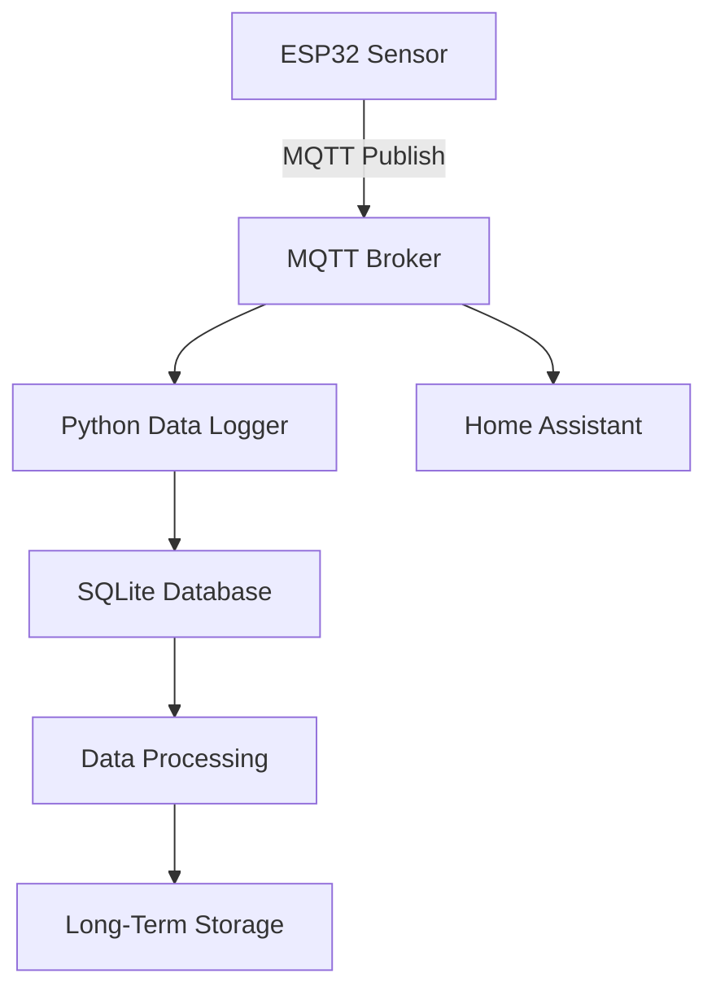

# BoilerStat: Home Heating System Monitoring Project

## System Overview

BoilerStat is a comprehensive home heating system monitoring solution designed to provide detailed insights into home heating performance, efficiency, and energy consumption.

## Technical Architecture

### Core Components

1. **Data Collection**: ESP32 Microcontroller
   - Capture real-time boiler and zone heating states
   - Measure system temperatures
   - Publish data via MQTT
2. **Communication**: MQTT Broker (Mosquitto)
   - Lightweight, real-time messaging protocol
   - Supports multiple subscribers
   - Low-overhead data distribution
3. **Data Storage**: SQLite Database
   - Lightweight, file-based database
   - Built-in Python support
   - Suitable for moderate data volumes
4. **Integration**: Home Assistant
   - Visualization
   - Optional automation
   - Dashboard creation

## Data Flow Architecture



## Data Management Strategy

### Data Capture Characteristics

- Sampling Frequency: 6-10 seconds
- Captured Metrics:
  - Boiler state (on/off)
  - Active heating zones
  - Outside temperature

### Data Retention Lifecycle

1. **Raw Data (1 Hour)**
   - High-frequency measurements
   - Detailed system state
   - Stored in raw events table
2. **Minute Aggregates (24 Hours)**
   - Compressed to 1-minute summaries
   - Average boiler runtime
   - Zone activation patterns
3. **Hourly Aggregates (Long-Term)**
   - Daily and weekly performance metrics
   - Compressed historical data
   - Basis for long-term analysis

### Aggregation Logic

- Progressively reduce data granularity
- Maintain statistical integrity
- Manage database size efficiently

## Technology Stack

### Hardware

- ESP32 Microcontroller
- Custom input board for signal conversion
- Temperature sensors

### Software

- **Microcontroller**: C++
- **Communication**: MQTT (Mosquitto)
- **Backend**: Python
- **Database**: SQLite
- **Visualization**: Home Assistant

## Development Environment

### Python Environment Management

- Python virtual environment (venv)
- Isolated dependencies
- Easy setup and reproducibility

### Required Packages

- paho-mqtt (MQTT client)
- pandas (data analysis)
- pyyaml (configuration)

## Getting Started Plan

### Initial Setup

1. Prepare development environment
2. Set up MQTT broker
3. Develop ESP32 data publisher
4. Create Python data logger
5. Implement SQLite data management
6. Integrate with Home Assistant

### Development Milestones

- [x] MQTT communication working ✅ (Mosquitto broker running, ESP32 simulator publishing)
- [x] Data logging to SQLite ✅ (26,763+ records in boilerstat.db, 5-second intervals)
- [ ] Basic data aggregation (implement minute/hourly summaries per architecture)
- [ ] Home Assistant integration
- [ ] Initial dashboard creation

### Current System Status (Updated: 2025-11-22)

**Operational Components:**
- ✅ Mosquitto MQTT Broker (Docker container)
- ✅ Python Data Logger (Docker container: boilerstat-listener)  
- ✅ SQLite Database (2.3MB, actively logging)
- ✅ ESP32 Simulator (external app publishing MQTT messages)

**Data Schema:**
```sql
boiler_readings table:
- timestamp, boiler_state, zone_1-6, received_at
- 26,763+ records with 5-second sampling frequency
```

**Next Development Phase:**
1. **Data Aggregation Implementation** - Create minute/hourly summary tables
2. **Performance Analytics** - Runtime calculations and efficiency metrics  
3. **Home Assistant Integration** - MQTT discovery and sensor setup

## Project Goals

1. Monitor heating system performance
2. Track energy consumption
3. Provide actionable insights
4. Support long-term system optimization